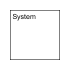
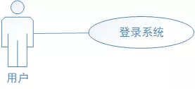
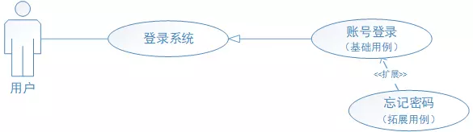
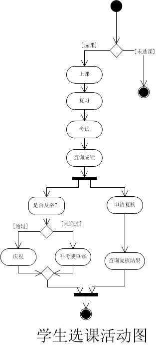

#uml-notes
UML（Unified Modeling Language）是一种统一建模语言，为面向对象开发系统的产品进行说明、可视化、和编制文档的一种标准语言。
下面将对UML的九种图+包图的基本概念进行介绍以及各个图的使用场景。


##基本概念　　

如下图所示，UML图分为用例视图、设计视图、进程视图、实现视图和拓扑视图，又可以静动分为静态视图和动态视图。

静态图分为：用例图，类图，对象图，包图，构件图，部署图。

动态图分为：状态图，活动图，协作图，序列图。


##用例图（UseCase Diagrams）
###用例图的作用
用例图主要回答了两个问题：1、是谁用软件。2、软件的功能。
从用户的角度描述了系统的功能，并指出各个功能的执行者，强调用户的使用者，系统为执行者完成哪些功能。


###用例图的组成与基本符号与元素
* 用例图的结构主要分为三个部分：参与者、用例、参与者与用例之间的关系

小人（参与者）actor


椭圆（用例）usecase


矩形（系统边界）system



关系
直线（关联关系）association


<>箭头（包含关系）includes


<>箭头（扩展关系）extends


空心箭头（泛化关系）generalisation


####参与者
顾名思义，代表系统外部与系统发生交互的人或事物；需要注意，人指的是参与者与系统发生交互时的角色，不代指具体的人。
事物指的是某一个应用程序或者特殊进程；例如微信登录，通过跳转微信确认登录信息，微信对系统产生输入时，可以把微信作为参与者；
而设定时间，强制退出账号时，时间这一特殊进程对系统产生输入，因此时间也可以作为参与者。


####用例
用例是系统外部可见的一个功能单元，是某一个参与者在系统中做某件事从开始到结束的一系列活动的集合，以及结束时应该返回的可观测、有意义的结果，
其中还包含可能的各种分支情况；具体用例在用例属性中说明。

 用例的特征
 
用例都是动宾结构；例如：登录账号

用例是相互独立的

用例由参与者启动

有可观测的执行结果

####关系
角色与用例之间的关系主要包括关联、泛化、包含、拓展和依赖。
#####关联关系
关系说明：表示参与者与用例之间的关系

展示形式：以一条直线相连

举例说明：用户登录系统

* 参与者与用例之间的关联关系



#####泛化关系
关系说明：表示参与者与参与者之间、用例与用例之间的关系

展示形式：用箭头表示，箭头从子参与者（子用例）指向父参与者（基础用例），一般父参与者（基础用例）相对子参与者（子用例）更为抽象

举例说明：VIP会员和普通用户，归纳为用户；账号登录与微信登录，也可归纳为登录系统。

* 用户之间、用例之间的归纳关系


#####包含关系
关系说明：表示用例与用例之间的关系

展示形式：用带有“包含”的箭头表示，箭头从基础用例指向包含用例

举例说明：用户在账号登录过程中，包括输入账号、输入密码、确认登录等操作

* 用例与用例之间的包含关系


#####拓展关系
关系说明：表示用例与用例之间的关系；用于拓展用例对基础用例的增强；拓展用例是在特定条件出现时，才会被执行的用例

展示形式：用带有“拓展”的箭头表示，由拓展用例指向基础用例

举例说明：用户在登录过程中忘记了密码

* 用例与用例之间的拓展关系


#####依赖关系
关系说明：表示用例与用例之间的关系；一个用例在活动执行过程中，要依赖另一个用例的执行

展现形式：以一条直线相连

举例说明：用户要登录系统后，才能查看首页信息

补充说明：A用例依赖B用例，A用例或使用B用例执行后的返回结果，或使用B用例执行部分功能。
依赖关系类似于包含关系，都是在用例执行过程中，调用其它用例来完成部分任务。

 * 用例与用例之间的依赖关系
 

#####注释
对于部分有特殊条件支撑的用例，也可以添加注释加以说明，例如VIP用户与普通用户登录系统后，
可查看的菜单、数据甚至对系统的操作都是不一样的，此时可以在对应用例上加以注释，以强调此用例的特殊需求。

* 对用例进行注释


##### 子系统
关系说明：用于强调某部分用例的强关联性，例如门户包含系统登录、首页信息展示等。

* 子系统与用例之间的关系


###用例图的画法与步骤

1.绘制系统边界。

2.绘制参与者，将参与者画在所有系统边界以外。

3.绘制用例，考虑每一个参与者是如何使用系统的，将相应的用例画在对应的系统中，用线将用例和参与者关联起来。

4.绘制用例间的关系：如包含关系、扩展关系和泛化关系。

5.绘制关联的外部支持系统，用线将支持系统和对应的用例关联起来。


###用例图练习
* 淘票票电影订票系统


* 猫眼电影订票系统
 


##类图（Class Diagrams）
* 类图是用户根据用例图抽象成类，描述类的内部结构和类与类之间的关系，类图是一种静态结构图。


###在UML类图中表示具体类

具体类在类图中用矩形框表示，矩形框分为三层：第一层是类名字。第二层是类的成员变量；第三层是类的方法。

类名：类的名称是每个类所必须有的构成，用于和其它类相区分，是一个文本串，可以分为简单名称和类名称。

属性：属性是类的组成部分，他描述了类在软件系统中代表的事物所具有的特性。类可以有属性也可以没有属性

方法：是对类的对象所能做的事物的抽象。

成员变量以及方法前的访问修饰符用符号来表示：“+”表示 public；“-”表示 private；“#”表示 protected；不带符号表示 default。


###在UML类图中表示抽象类
抽象类在UML类图中同样用矩形框表示，但是抽象类的类名以及抽象方法的名字都用斜体字表。


###在UML类图中表示接口
接口在类图中也是用矩形框表示，但是与类的表示法不同的是，接口在类图中的第一层顶端用构造型 <<interface>>表示，下面是接口的名字，第二层是方法。

###在UML类图中表示包


###在类图中表示关系
* 关系共有六种类型，分别是泛化关系（Generalization）、实现关系（Realization）、组合关系(Composition)、聚合关系（Aggregation）、关联关系（Association)、依赖关系(Dependency)。

各种关系的强弱顺序： 泛化 = 实现 > 组合 > 聚合 > 关联 > 依赖


（1）泛化

【泛化关系】：泛化关系（Generalization）是指对象与对象之间的继承关系。如果对象A和对象B之间的“is a”关系成立，那么二者之间就存在继承关系，对象B是父对象，对象A是子对象。
例如：老虎是动物的一种，即有老虎的特性也有动物的共性。


（2）实现

【实现关系】：实现关系是指接口及其实现类之间的关系。在UML类图中，实现关系用空心三角和虚线组成的箭头来表示，从实现类指向接口。在Java代码中，实现关系可以直接翻译为关键字 implements。。


（3）关联

　【关联关系】：关联关系（Association）是指对象和对象之间的连接，它使一个对象知道另一个对象的属性和方法。在Java中，关联关系的代码表现形式为一个对象含有另一个对象的引用。也就是说，如果一个对象的类代码中，包含有另一个对象的引用，那么这两个对象之间就是关联关系。
        
关联关系有单向关联和双向关联。如果两个对象都知道（即可以调用）对方的公共属性和操作，那么二者就是双向关联。如果只有一个对象知道（即可以调用）另一个对象的公共属性和操作，那么就是单向关联。大多数关联都是单向关联，单向关联关系更容易建立和维护，有助于寻找可重用的类。
        
在UML图中，双向关联关系用带双箭头的实线或者无箭头的实线双线表示。单向关联用一个带箭头的实线表示，箭头指向被关联的对象


一个对象可以持有其它对象的数组或者集合。
在UML中，通过放置多重性（multipicity）表达式在关联线的末端来表示。
多重性表达式可以是一个数字、一段范围或者是它们的组合。多重性允许的表达式示例如下：

数字：精确的数量
*或者0..*：表示0到多个

0..1：表示0或者1个，在Java中经常用一个空引用来实现

1..*：表示1到多个

关联关系又分为依赖关联、聚合关联和组合关联三种类型。


  
（4）依赖关系

  【依赖关系】：依赖（Dependency）关系是一种弱关联关系。如果对象A用到对象B，但是和B的关系不是太明显的时候，就可以把这种关系看作是依赖关系。如果对象A依赖于对象B，则 A “use a” B。比如驾驶员和汽车的关系，驾驶员使用汽车，二者之间就是依赖关系。
         
在UML类图中，依赖关系用一个带虚线的箭头表示，由使用方指向被使用方，表示使用方对象持有被使用方对象的引用

依赖关系在Java中的具体代码表现形式为B为A的构造器或方法中的局部变量、方法或构造器的参数、方法的返回值，或者A调用B的静态方法。


代码清单1和代码清单2所示的Java代码来演示对象和对象之间的依赖关系。
```
//代码清单1 B.java
public class B {
  public String field1;   //成员变量

  public void method1() {
    System.println("在类B的方法1中");
  }

  public static void method2() {                 //静态方法
    System.out.println("在类B的静态方法2中");
  }
}
```
A类依赖于B类，在A类中定义了四个方法，分别演示四种依赖形式。
```
/* 代码清单2 A.java
  A依赖于B
*/

public class A {
  public void method1() {
    //A依赖于B的第一种表现形式：B为A的局部变量
    B b = new B();
    b.method1();
  }

  public void method2() {
    //A依赖于B的第二种表现形式： 调用B的静态方法
    B.method2();
  }

  public void method3(B b)  {
    //A依赖于B的第三种表现形式：B作为A的方法参数
    String s = b.field1;
  }

  //A依赖于B的第四种表现形式：B作为A的方法的返回值
  public B method4() {
    return new B();
  }
}
```

（5）聚合关系

【聚合关系】：聚合（Aggregation）是关联关系的一种特例，它体现的是整体与部分的拥有关系，即 “has a” 的关系。
此时整体与部分之间是可分离的，它们可以具有各自的生命周期，部分可以属于多个整体对象，也可以为多个整体对象共享，所以聚合关系也常称为共享关系。
例如，公司部门与员工的关系，一个员工可以属于多个部门，一个部门撤消了，员工可以转到其它部门。

聚合关系是关联关系的一种，是强的关联关系；关联和聚合在语法上无法区分，必须考察具体的逻辑关系。
    


（6）组合关系
   
   【组合关系】：组合（Composition）也是关联关系的一种特例，它同样体现整体与部分间的包含关系，即 “contains a” 的关系。
   但此时整体与部分是不可分的，部分也不能给其它整体共享，作为整体的对象负责部分的对象的生命周期。
   这种关系比聚合更强，也称为强聚合。如果A组合B，则A需要知道B的生存周期，即可能A负责生成或者释放B，或者A通过某种途径知道B的生成和释放。

   【箭头及指向】：带实心菱形的实线，菱形指向整体
   
 
在Java代码形式上，聚合和组合关系中的部分对象是整体对象的一个成员变量。
但是，在实际应用开发时，两个对象之间的关系到底是聚合还是组合，有时候很难区别。
在Java中，仅从类代码本身是区分不了聚合和组合的。
如果一定要区分，那么如果在删除整体对象的时候，必须删掉部分对象，那么就是组合关系，否则可能就是聚合关系。
从业务角度上来看，如果作为整体的对象必须要部分对象的参与，才能完成自己的职责，那么二者之间就是组合关系，否则就是聚合关系。

 

（7）各种类图关系


##对象图（Object Diagrams）
 
对象图(Object Diagram)描述的是参与交互的各个对象在交互过程中某一时刻的状态。对象图可以被看作是类图在某一时刻的实例。
在UML中，对象图使用的是与类图相同的符号和关系，因为对象就是类的实例。下图显示了对象图的模型。
其中节点可以是对象也可以是类，连线表示对象之间的关系。

 * 可以将对象图设想为特定时刻正在运行的系统的快照。


   类图和对象图的区别
   


##包图
* 包图是描述包与包之间的关系的uml图。
###概念
 当对一个比较复杂的软件系统进行建模时，会有大量的类、接口、组件、节点和图需要处理；
 如果放在同一个地方的话，信息量非常的大，显得很乱，不方便查询，
 所以就对这些信息进行分组，将语义或者功能相同的放在同一个包中，这样就便于理解和处理整个模型。

  
###包的表示


###可见性
公有访问（public：+）：包内的模型元素可以被任何引入了此包的其他包的内含元素访问。

保护访问（protected：#）：表示此元素能被该包的子包内所含元素访问。

私有访问（private：-）：表示此元素只能被属于同一包的内含元素访问，对包外元素完全不可见。


###包的依赖关系
*  如果一个包要访问或者导入另一个包中的元素，则两个包之间存在着依赖关系。

《use》关系：客户包依赖于提供者包，默认依赖关系。

《import》关系：客户包中的元素能够访问提供者包中的所有元素。

《access》关系：只想使用提供者包中的元素，而不想将其命名空间合并应使用该关系。

《trace》关系：表示一个包到另一个包的历史发展。


##状态图（Statechart Diagrams）
###概念
状态图（Statechart Diagram）是一种由状态、变迁、事件和活动组成的状态机，用来描述一个特定对象的所有可能状态以及由于各种事件的发生而引起的状态之间的转移条件。

* 播放器的各种状态流转


* 运营所谓的热点节目，节目存在各种状态。


###状态图的基本元素


（1）状态：指在对象的生命期中满足某些条件、执行某些活动或等待某些事件时的一个条件或状态。

（2）转移：两个状态之间的一种关系，表示对象将在第一个状态中执行一定的动作，并在某个特定事件发生而某个特定的条件满足时进入第二个状态。

（3）起点：同活动图

（4）终点：同活动图
###状态图和活动图的区别
状态图侧重从行为的结果来描述（状态）

活动图侧重从行为的动作来描述（活动）

###案例
* 广告管理系统中，广告发布计划的各个状态变化。


##活动图（Activity Diagrams）
###概述
活动图是状态图的一种特殊情况，这些状态大都处于活动状态。本质是一种流程图，它描述了活动到活动的控制流。　　　　

交互图强调的是对象到对象的控制流，而活动图则强调的是从活动到活动的控制流。

活动图是一种表述过程基理、业务过程以及工作流的技术。它可以用来对业务过程、工作流建模，也可以对用例实现甚至是程序实现来建模。

###活动图和流程图的区别

活动图可以表达并发的动作，而流程图不能。

活动图是面向对象的，而流程图是面向过程的。活动图有对象的输入、输出，流程图重点是处理流程，有明确的时间概念。

活动图的对象与活动有明显区分，流程图并不强调这点。

活动图可以有多个结束状态，而流程图只能有一个结束状态。

###基本语法

每个活动图都有一个开始状态、一个或多个结束状态。

圆角矩形表示活动，该活动应当能一个持续一定时间，也就是说是一个持续动作。在不使用泳道的情况下，其中文字应该是主谓宾形式，使用泳道，应该是动宾形式。

流程方向，代表该活动往什么方向进行。

菱形用作判定和合并，也就是说用户条件分支和合并。

同步栅代表的是一个并行活动，同步栅应当分叉、合并配对使用

流程方向上的中括号表示条件，其中的文字叫做监护，简单的理解就是，该文字用于表示流程中所发生的分叉，比如是、否这样的分叉。


###带泳道的活动图  
* 泳道也叫作分区，在泳道中表示活动的发起者谁。这时，活动中所填文字，只要采用动宾形式就行了。


###并行活动
* 并行活动是由同步栅来控制的，同步栅必须分叉和汇合成对出现。


###对象流
* 当活动图中出现了工作产品时，活动流就变成了对象流。
矩形表示的是工作产品，是某个类的实例或者是某些活动输出的结果。矩形里面的文字要用名词表示。
对象流的输入输出是以活动为中心的，从工作产品输入到活动是输入对象流，从活动输出到工作产品是输出对象流。

基本语法


###注释
* 当某些时候UML不足以表达或者是表达起来很麻烦时可以采用注释的方式进行补充说明，该方法适用于任意UML图。


###小结
明确该流程要达到怎样的业务目的。

该流程有什么角色参与？哪些是主要角色？

先画出流程主干，再考虑分支。

明确流程主干中活动涉及到的角色。

当不注意表达或者表达起来很麻烦时，要使用注释。

适当的控制活动的粒度。

先画出反映当前情况的流程，再想办法优化，画出优化后的流程。

对比前后差异，整理出改动部分。

###活动图案例


##序列图-时序图（Sequence Diagrams）
  交互图的一种，序列图是用来描述对象之间消息发送的先后次序，阐明对象之间的交互过程以及在系统执行过程中的某一具体时刻将会发生什么事件。
  
  
消息用从一个对象的生命线到另一个对象生命线的箭头表示。箭头以时间顺序在图中从上到下排列。


###时序图的元素
* 画时序图时会涉及7种元素：角色(Actor)、对象(Object)、生命线(LifeLine)、控制焦点(Activation)、消息(Message)、自关联消息、组合片段。
其中前6种是比较常用和重要的元素，剩余的一种组合片段元素不是很常用，但是比较复杂。

1角色(Actor)

系统角色，可以是人或者其他系统，子系统。以一个小人图标表示。


2对象(Object)

对象位于时序图的顶部,以一个矩形表示。对象的命名方式一般有三种：

（1） 对象名和类名。例如：华为手机:手机、loginServiceObject:LoginService。

（2） 只显示类名，不显示对象，即为一个匿名类。例如：:手机、:LoginSservice。

（3） 只显示对象名，不显示类名。例如：华为手机:、loginServiceObject:。


3生命线(LifeLine)

时序图中每个对象和底部中心都有一条垂直的虚线，这就是对象的生命线(对象的时间线)。以一条垂直的虚线表。


4控制焦点(Activation)
控制焦点代表时序图中在对象时间线上某段时期执行的操作。以一个很窄的矩形表示。

5消息(Message)
（1）同步消息(Synchronous Message)
 * 消息的发送者把控制传递给消息的接收者，然后停止活动，等待消息的接收者放弃或者返回控制。用来表示同步的意义。以一条实线+实心箭头表示。
   
   

（2）异步消息(Asynchronous Message)
* 消息发送者通过消息把信号传递给消息的接收者，然后继续自己的活动，不等待接受者返回消息或者控制。异步消息的接收者和发送者是并发工作的。以一条实线+大于号表示。


（3）返回消息(Return Message)
* 返回消息表示从过程调用返回。以小于号+虚线表示。

6自关联消息
* 表示方法的自身调用或者一个对象内的一个方法调用另外一个方法。以一个半闭合的长方形+下方实心剪头表示。

例子


* 时序图解释

  1，用户输入手机密码
  2，打开手机
  3，打开微信扫一扫
  4，返回微信扫一扫界面
  5.1 扫描商家收款码
  5.2 商家生成收款二维码
  5.3 返回收款二维码
  5.4 识别商家收款码
  6，提示用户输入微信支付密码
  7.1 输入微信支付密码
  7.2 微信验证用户输入密码正确
  7.3 向商家汇款
  7.4 汇款成功
  8，提示用户支付成功

7组合片段

* 组合片段用来解决交互执行的条件和方式，它允许在序列图中直接表示逻辑组件，用于通过指定条件或子进程的应用区域，为任何生命线的任何部分定义特殊条件和子进程。组合片段共有13种，如下


常用组合片段举例
（1）抉择（Alt）

抉择在任何场合下只发生一个序列。 可以在每个片段中设置一个临界来指示该片段可以运行的条件。else 的临界指示其他任何临界都不为 True 时应运行的片段。
如果所有临界都为 False 并且没有 else，则不执行任何片段。Alt片段组合可以理解为if..else if...else条件语句。

如果7.3向商家汇款的成功或失败流程需要在时序图中体现出来，可以这么使用Alt片段组合。


（2）选项（Opt）

* 包含一个可能发生或不发生的序列。Opt相当于if..语句。


（3）循环（Loop）
* 片段重复一定次数，可以在临界中指示片段重复的条件。Loop相当于for语句。


（4）并行（Par）
* 并行处理，片段中的事件可以并行交错。Par相当于多线程。


8注释
 
  

9约束

   

###时序图的绘制步骤
1，划清边界，识别交互语境

所谓划清边界是是指要确定好绘制时序图的范围。在微信支付例子中省略列商家打开微信、输入收款金额等交互消息，这些不是我们需要体现的，我们主要体现的是用户的扫码支付流程。

所谓识别交互语境就是要知道自己绘制时序图的前提和背景。在微信支付的例子中用户登录了微信、开通了支付功能是前提，背景是用户需要扫描付款买东西。

2，梳理时序图中的角色和对象都有哪些

微信支付的例子中角色只有一个，即用户。对象有华为手机：手机、安卓版微信：微信、：商家。

3，对象之间有哪些交互消息 

对象之间交互的消息详见以上时序图。

###时序图的绘制技巧


1，从初始消息开始画，依次画出随后消息，并给每个消息分配序号，方便理解。

2，角色和对象用名词，消息用动词。

3，角色放在时序图的开始位置，对象重要程度或使用频率从左到右排列。这就要根据时间的流程考虑了，是一个比较主观的事情。


4，控制焦点两端要以消息元素封顶，控制焦点不要超过消息元素。
* 正确示范


* 错误示范


###练习
* 用户登录系统时序图


 
  
##协作图（Collaboration Diagrams）
###概念
交互图的一种，描述了收发消息的对象的组织关系，强调对象之间的合作关系。时序图按照时间顺序布图，而写作图按照空间结构布图。
序列图是一种强调时间顺序的交互图，序列图提供了随着时间推移的、清晰的、可视化的轨迹。

###基本元素
####对象


####链


####消息

####消息编号
消息的编号有两种，一种是无层次编号(按顺序编号)，它简单直观；另一种是嵌套的编号，它更易于表示消息的包含关系。

#### 迭代标记
迭代标记用 * 号表示，表示循环，通常还有迭代表达式，用来说明循环规则。
```

迭代表达式	            语义
[i:=1..n］	          迭代n次
[I=1..10]	          I迭代10次
[while(表达式)]	      表达式为true时才进行迭代
[until(表达式)]	      迭代到表达识为true时，才停止迭代
[foreach(对象集合)］	  在对象集合上迭代
```

###案例


##构件图（Component Diagrams）

　　构件图是用来表示系统中构件与构件之间，类或接口与构件之间的关系图。其中，构建图之间的关系表现为依赖关系，定义的类或接口与类之间的关系表现为依赖关系或实现关系。


##部署图（Deployment Diagrams）

　　描述了系统运行时进行处理的结点以及在结点上活动的构件的配置。强调了物理设备以及之间的连接关系。

   部署模型的目的：描述一个具体应用的主要部署结构，通过对各种硬件，在硬件中的软件以及各种连接协议的显示，可以很好的描述系统是如何部署的；平衡系统运行时的计算资源分布；可以通过连接描述组织的硬件网络结构或者是嵌入式系统等具有多种硬件和软件相关的系统运行模型。


